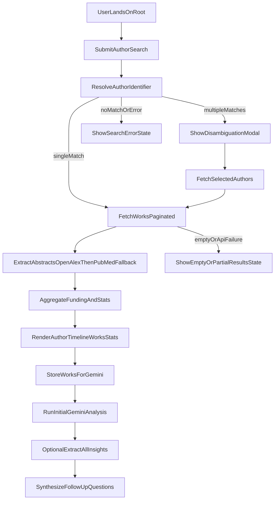
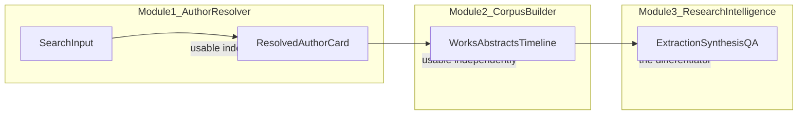

# UX Review - Biomedical Abstract Explorer

## 1) Review Scope And Purpose

This document maps the current UX baseline for the service, to support a full redesign in a later phase without losing critical product behavior.

Review goals:
- inventory all user-facing visual elements currently rendered
- map the end-to-end UX flow pipeline, including branches and failure paths
- identify UX risks and constraints that redesign must preserve or explicitly address

Primary implementation sources:
- `index.html` (single-page UI, styles, and client logic)
- `app.py` (entry route, search routes, SSE progress stream)
- `author_resolver.py`, `works_service.py`, `works_fetcher.py`, `abstract_extractor.py` (search/fetch/extract pipeline)
- `gemini_routes.py`, `gemini_analyzer.py` (AI extraction/synthesis flows)

---

## 2) Product Surface Summary

The current product is a single-page, form-first research exploration UI:
- user submits an author identifier (name, OpenAlex ID, ORCID)
- system resolves author and fetches works
- abstracts are sourced from OpenAlex and optionally PubMed fallback
- results are shown as author metadata, timeline, work cards, and source stats
- optional AI layer adds extraction, synthesis Q&A, and summary panels

The app exposes one dominant interaction model: **search -> progressive retrieval -> inspect results -> optionally run AI insights**.

---

## 3) Visual Element Inventory

## 3.1 Global Layout Regions

- `Header`: product title and subtitle.
- `Intro`: short value proposition and use-case tags.
- `Search section`: main form and primary CTA.
- `Progress container`: dynamic progress bar + status lines (initially hidden).
- `Results section`: author card, timeline, sorting controls, works list (initially hidden).
- `Footer`: OpenAlex attribution link.
- `Modal overlay`: disambiguation flow for multiple author matches.
- `Dynamic extension panels`: Gemini "Research Profile" and funding panel inserted after results.

## 3.2 Core Input And Control Components

- **Text input**: author identifier (required).
- **Email input**: optional OpenAlex polite-pool hint.
- **Affiliation hint input**: optional disambiguation signal.
- **Checkbox**: PubMed fallback enable/disable (default checked).
- **Primary button**: Search (supports loading style and disabled state).
- **Sort select**: works ordering by year/title/citations.
- **Modal controls**: close action, candidate checkboxes, fetch selected CTA.
- **AI controls**: extraction CTA, question input, ask CTA, preset prompt CTA.

## 3.3 Results Components

- **Author card**:
  - name
  - metadata chips (works, citations, ID, conditional ORCID)
  - affiliations tags
  - publication timeline chart (conditional)
- **Works header**:
  - section title
  - sort control cluster
  - displayed works count
- **Source stats bar**:
  - OA count
  - PM count
  - missing abstracts count
- **Works list**:
  - repeated work cards with title, source badge, metadata, abstract text
- **Source badges**:
  - OA (OpenAlex)
  - PM (PubMed)
  - none (dash)

## 3.4 Modal And Candidate UI

- **Disambiguation modal**:
  - title and query subtitle
  - candidate cards with checkbox selection
  - candidate info: name, ORCID flag, works, citations, affiliations
  - selected count indicator
  - fetch-selected button with disabled/loading behavior

## 3.5 AI/Insight Panels (Dynamic)

- **Research Profile section**:
  - section header and abstract count
  - extraction description text
  - extract button with cached/disabled behavior
  - extraction progress panel (hidden until active)
  - extraction summary panel (hidden until data available)
  - auto-analysis response area
  - follow-up Q&A input + ask button + preset prompt
  - response container (hidden initially)
- **Funding panel (experimental)**:
  - section heading and "experimental" label
  - funder rows with mention/award/work metrics
  - progress bars
  - empty message if no funding data

---

## 4) Component State Inventory

## 4.1 Search And Submission States

- **Default**: empty/placeholder form controls; search enabled.
- **Loading**: search button enters spinner style and disabled state.
- **Error**: error message shown in dedicated error container.
- **Reset**: results and modal hidden before a new request.

## 4.2 Progress Feedback States

- **Hidden**: default before request.
- **Connected**: SSE starts; progress UI becomes visible.
- **Indeterminate**: no numeric progress yet.
- **Determinate**: width-based progress with percentage updates.
- **Verbose status**: title, ETA, current item, count, live text, countdown.
- **Terminal**: closes/hides on complete or error phase.

## 4.3 Results Rendering States

- **Hidden**: no search success yet.
- **Single-author success**: author card + timeline (if data) + works list.
- **Multi-author success**: combined author/works/funding aggregation view.
- **Conditional fields**:
  - ORCID shown only when available
  - affiliations shown only when present
  - timeline shown only when year distribution exists

## 4.4 Work Card States

- **Abstract present**: body text shown.
- **Abstract missing**: explicit fallback text style.
- **With DOI**: title links externally.
- **Without DOI**: plain title text.
- **Hover**: visual highlight treatment.

## 4.5 Disambiguation States

- **Closed**: default hidden.
- **Open**: candidate list visible.
- **Selection**: candidate card highlighted as selected.
- **Action readiness**: fetch-selected disabled until at least one candidate is chosen.

## 4.6 AI Flow States

- **Not mounted**: before results.
- **Mounted**: after works are stored for AI.
- **Initial analysis loading**: spinner + placeholder text.
- **Initial analysis success**: formatted response card.
- **Initial analysis failure**: inline failure block.
- **Extraction idle**: button available.
- **Extraction running**: button disabled; progress panel visible with SSE updates.
- **Extraction complete**: button marks completion; summary panel shown.
- **Follow-up Q&A loading**: response area shows active analysis text.
- **Follow-up Q&A success/error**: formatted answer or inline error message.

---

## 5) UX Flow Pipeline (End-To-End)

## 5.1 Primary User Journey

1. User lands on `/` and sees search-first interface.
2. User submits identifier and optional hints/fallback options.
3. Frontend opens SSE stream and sends search request.
4. Backend resolves identifier:
   - direct OpenAlex/ORCID resolution, or
   - name search with candidate ranking.
5. If multiple candidates, user enters modal disambiguation path.
6. Backend fetches works from OpenAlex (paginated), then extracts abstracts.
7. Optional PubMed fallback fills missing abstracts when enabled.
8. Backend aggregates abstract-source stats and funding metadata.
9. Frontend renders author/works/timeline/stats panels.
10. Frontend stores works for Gemini and mounts AI section.
11. User optionally runs extract-all insights (parallel worker pipeline + SSE).
12. User asks follow-up questions (cached synthesize path preferred after extraction).

## 5.2 Backend Pipeline By Stage

- **Stage A - Entry**: `GET /` serves `index.html`.
- **Stage B - Search request**: `POST /api/search` validates and routes resolution.
- **Stage C - Resolution**:
  - `author_resolver.resolve_by_name()` for text name queries
  - direct ID/ORCID lookups for canonical IDs
- **Stage D - Works processing**:
  - `works_fetcher.fetch_works_paginated()` collects works
  - `works_service.process_author_works()` orchestrates extraction + stats
- **Stage E - Abstract acquisition**:
  - OpenAlex abstract first
  - optional PubMed fallback path for missing abstracts
- **Stage F - Funding aggregation**: funders summary built from works metadata.
- **Stage G - AI optional**:
  - `POST /api/gemini/store`
  - `POST /api/gemini/extract-all` + `GET /api/gemini/extract-progress/<session_id>`
  - `POST /api/gemini/synthesize` (or `/analyze` fallback)

## 5.3 Branches And Error Paths (User-Visible)

- **Missing identifier** -> validation error response.
- **No author candidates** -> explicit "not found" error.
- **Multiple candidate matches** -> disambiguation modal path.
- **Author lookup failure** -> error state in search flow.
- **External API failures** -> partial results, missing abstracts, or error messages.
- **Gemini missing key/no stored works/in-progress conflicts** -> explicit API error messages.
- **Extraction/synthesis failure** -> inline error block in AI section.

## 5.4 Progress And Async Feedback Channels

- Main search/fetch pipeline: SSE via `/api/progress/<session_id>`.
- AI extraction pipeline: SSE via `/api/gemini/extract-progress/<session_id>`.
- Both flows use message + phase semantics to drive client-side visibility and completion behavior.

---

## 6) UX Pipeline Diagram

---

## 7) Visual/Interaction Consistency Notes (Current Baseline)

- Single-file architecture (`index.html`) mixes markup, styling, and behavior, which increases redesign complexity.
- Component styling is mixed between class-based CSS and extensive inline styles (especially AI section), reducing consistency.
- State feedback quality varies by surface:
  - strong in search/extraction progress
  - weaker for some empty/error states in downstream panels
- Typography and spacing systems are expressive but not tokenized into a formal design system.
- Accessibility baseline appears partial (limited semantic/accessibility metadata and inconsistent focus affordances).

---

## 8) UX Risks To Preserve During Redesign

- **Long-running operations must keep progressive feedback**:
  - works/abstract pipeline and AI extraction both rely on visible progress for trust.
- **Disambiguation quality is core to success**:
  - incorrect candidate handling breaks the journey early.
- **Multi-author aggregation path must remain explicit**:
  - combined view changes stats, deduplication, and author identity representation.
- **Source transparency must stay visible**:
  - OA vs PM vs missing is a critical credibility signal.
- **Performance-sensitive branches require expectation setting**:
  - PubMed fallback and AI extraction can be materially slower than baseline search.

---

## 9) Redesign Handoff Checklist

- Confirm future information architecture for:
  - search initiation, progress, and result inspection
  - disambiguation UX
  - optional AI layer discoverability and boundaries
- Define a formal design system:
  - typography scale
  - spacing scale
  - component tokens
  - state patterns (loading/empty/error/success)
- Preserve these required flows:
  - single author
  - multi-candidate disambiguation
  - multi-author combined output
  - AI optional path with extraction and follow-up
- Establish UX quality bars:
  - accessibility baseline (keyboard, focus, semantic labels)
  - error language and recoverability
  - progressive feedback standards for long-running tasks
- Define analytics/testing plan for redesign:
  - completion rate by stage
  - drop-off points in search/disambiguation/AI
  - response-time perception thresholds

---

## 10) Value Assessment

### 10.1 What The Service Actually Solves

OpenAlex has no native "give me all abstracts for this author" view. PubMed does, but painfully. This app solves a genuine data-assembly problem: it stitches OpenAlex + PubMed into a single, unified author-abstract corpus that does not exist anywhere else in one click. The Gemini layer then turns that corpus into actionable interpretation -- structured extraction, critical synthesis, follow-up Q&A.

The core value proposition is **time-to-insight compression**: a user arrives with "what does this researcher actually do?" and gets a structured answer faster than any manual alternative.

### 10.2 Where Value Is Weak Or Unearned

- The use-case badges ("Prep for PI interviews", "Literature reviews", "Know your collaborators", "Grant writing research") are broad marketing claims. The actual UX only serves one well: understanding a single researcher's output. It does not help with literature reviews (no topic search), collaborator comparison (no side-by-side), or grant writing (funding panel is marked "experimental" and adds little).
- Value gets diluted by **time cost**: PubMed fallback + Gemini extraction can take minutes. A user prepping for a PI interview will not wait 5 minutes unless the payoff is clearly signaled upfront.
- The AI layer -- the most differentiating capability -- is buried at the bottom of a long scroll, behind a manual button, after a second long wait. It reads as an afterthought, not as the main event.

---

## 11) Modular Redesign Strategy

### 11.1 The Three Real Modules

The current monolithic pipeline actually contains three distinct functional units that should become independent, composable modules:

**Module 1 -- Author Resolver**
- Input: name / OpenAlex ID / ORCID
- Output: resolved author identity card (metadata, affiliations, ORCID)
- Characteristics: fast, self-contained, always useful on its own
- Backend stages: B, C

**Module 2 -- Corpus Builder**
- Input: resolved author(s)
- Output: works list with abstracts, source transparency badges, timeline chart, funding summary
- Characteristics: slower (data assembly), the "heavy lift" stage
- Backend stages: D, E, F

**Module 3 -- Research Intelligence**
- Input: assembled corpus
- Output: structured extraction summary, synthesis narrative, follow-up Q&A
- Characteristics: the primary differentiator; currently the most buried
- Backend stages: G

### 11.2 Why Modularity Matters

The current pipeline is strictly sequential: search -> wait -> wall of cards -> scroll down -> find AI section -> wait again -> read analysis. Every stage gates the next. If any stage is slow, the whole experience degrades.

With modular decomposition, each module delivers independent value, has its own loading/completion state, and can be rendered as soon as its data is ready:

A user can get value from Module 1 alone (quick author lookup). Module 2 adds depth. Module 3 adds interpretation. Each module has closure without requiring the next.

### 11.3 Proposed Panel Layout

The redesign should express modularity as a spatial layout, not a vertical scroll:

- **Panel A (persistent anchor)**: Author identity -- always visible once resolved, shows key metadata. Resolves near-instantly.
- **Panel B (main content area)**: Corpus view -- works list, timeline, source stats. Streams in progressively as data arrives. Sortable, filterable.
- **Panel C (intelligence sidebar or promoted section)**: AI layer -- synthesis narrative, extraction summary, Q&A. Starts building automatically in background once corpus is assembled. Surfaces as soon as ready, without requiring manual trigger.

This maps directly to the three backend stage groups already in place.

### 11.4 Time-To-Insight Improvements

Current path: form fill -> 10-30s fetch -> scroll cards -> click extract -> 2 min wait -> read long text. Total: 3-5 minutes minimum.

Redesigned path:
1. Show author card immediately after resolution (< 2s).
2. Stream works into corpus panel as they arrive (progressive, not blocking).
3. Start AI extraction automatically once corpus is assembled (no manual button).
4. Surface AI synthesis prominently as soon as it completes (no scroll required).
5. Estimated perceived time-to-first-insight: under 30s for author card + first works, AI synthesis arrives while user is still exploring corpus.

---

## 12) Elements To Cut Or Demote

- **Funding panel**: either promote to a real, tested feature or remove entirely. "Experimental" UI erodes trust.
- **Use-case badges**: replace with a single honest tagline that reflects the actual strength (e.g., "Understand any researcher's work in 60 seconds").
- **Email field**: backend optimization detail, not a user concern. Use a sensible default or move to a settings/advanced toggle.
- **PubMed fallback checkbox**: implementation concern masquerading as a user choice. Better approach: always attempt PubMed, show a "corpus completeness" indicator on results, let user manually request deeper fetch if coverage is low.
- **Extraction button as a manual step**: auto-trigger extraction after corpus assembly. The user should not have to opt in to the tool's best feature.

---

## 13) Conclusion

The service solves a real problem -- assembling a complete author-abstract corpus from fragmented sources and making it interpretable with AI. The core flow (resolve author -> build corpus -> generate intelligence) is sound and maps cleanly to three independent modules.

The highest-leverage redesign moves:
1. **Decompose the monolithic scroll into three independent, simultaneously-rendering modules** -- each with its own loading state, completion signal, and standalone value.
2. **Promote the AI intelligence layer from afterthought to primary output** -- auto-trigger it, surface it prominently, reduce the perceived wait.
3. **Cut implementation details from the user surface** -- email, PubMed checkbox, experimental labels.
4. **Reframe the product identity around its actual strength**: time-to-insight compression for understanding a researcher's work, not four vague use cases.
